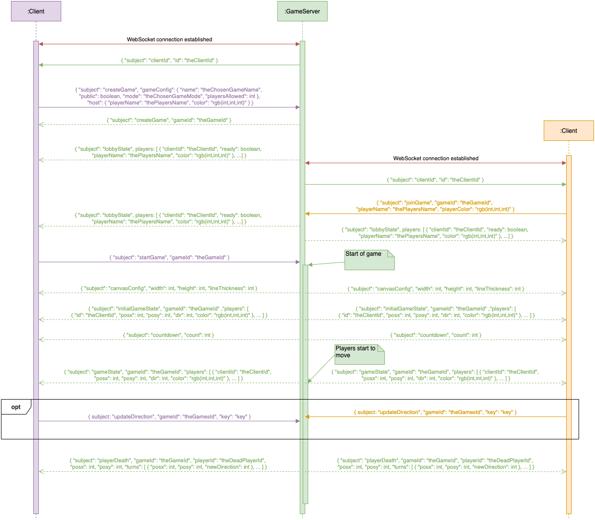

## Client-Server-Messaging

### SSD Game procedure

Draw.io file: [Game procedure SSD draw.io file](GameProcedure_SSD.drawio)

### On opening ws-connection

|Description|JSON|further information|FE|BEt|BEg|
|---|---|---|---|---|---|
|~~Client sends client connection after successfully setup Websocket connection to gameserver.~~ REMOVED|`{ subject: "clientConnected" }`||:skull:|❌|Not necessary|
|Game server sends client the id of the just created connection.|`{ "subject": "clientId", "id": "theClientId" }`||✅|✅|🆓|
|Client requests all currently publicly open games.|`{ "subject": "currentPublicGames" }`||✅|✅|✅|
|Game server sends all currently publicly open games and their associated properties to client who requested them.|`{ "subject": "currentPublicGames", "games": [ { "id": "theGameId", "name": "theGameName", "playersJoined": int, "playersAllowed": int, "mode": "gameMode", }, ...] }`|gameMode = "classic" or "battleRoyale"|✅|✅|✅|

### On game creation
|Description|JSON|further information|FE|BEt|BEg|
|---|---|---|---|---|---|
|Client requests to create a new game.|`{ "subject": "createGame", "gameConfig": { "name": "theChosenGameName", "public": boolean, "mode": "theChosenGameMode", "playersAllowed": int }, "host": { "playerName": "thePlayersName", "color": "rgb(int,int,int)" } }`|gameMode = "classic" or "battleRoyale"|✅|✅|✅|
|Client requests to delete a game.|`{subject: "deleteGame", gameId: "theGameId" }`||✅|partially|✅|
|GameServer sends id of the just created game to client who requested the creation.|`{ "subject": "createGame", "gameId": "theGameId" }`||✅|✅|🆓|

### Before game start
|Description|JSON|further information|FE|BEt|BEg|
|---|---|---|---|---|---|
|Game server continously updates all joined clients by broadcasting lobby-state.|`{ "subject": "lobbyState", players: [ { "clientId": "theClientId", "ready": boolean }, ...], "host": { "clientId":"theHostClientsId" }, "gameConfig": {"name": "theChosenGameName", "public": boolean, "mode": "theChosenGameMode", "playersAllowed": int } }`|**continous broadcast**|✅|✅|✅|
|Client requests to join a specific game.|`{ "subject": "joinGame", "gameId": "theGameId", "playerName":"ThePlayersName", "playerColor": "rgb(int,int,int)" }`||✅|✅|✅|
|Client sends player config update on change|`{ "subject": "playerConfigUpdate", "playerName": "thePlayersName", "playerColor": "rgb(int,int,int)","ready": boolean }`||❌|❌|❌|
|Game server sends the client the game configurations the client needs to know about in order to display the game correctly.|`{ "subject": "canvasConfig", "width": int, "height": int, "lineThickness": int }`||✅|✅|✅|
|Client that is host of game to be started orders game server to start the game.| `{ "subject": "startGame", "gameId": "theGameId" }`||✅|✅|✅|

### On game start
|Description|JSON|further information|FE|BEt|BEg|
|---|---|---|---|---|---|
|Game server broadcasts initial game state to all players being part of the starting game.|`{ "subject": "initialGameState", "gameId": "theGameId", "players": [ { "id": "theClientId", "posx": int, "posy": int, "dir": int, "color": "rgb(int,int,int)" }, ... ] }`|**broadcast**|✅|✅|✅|
|Game server broadcasts countdown to all players being part of the starting game.|`{ "subject": "countdown", "count": int, "round": { "current": int, "total": int } }`|**continous broadcast**|✅|✅|✅|

### While game's running
|Description|JSON|further information|FE|BEt|BEg|
|---|---|---|---|---|---|
|Game server continously broadcasts current game state to all clients being part of running game. **Contains only players that are currently alive**|`{ "subject": "gameState", "gameId": "theGameId", "players": [ { "clientId": "theClientId", "posx": int, "posy": int, "dir": int, "color": "rgb(int,int,int)" }, ... ] }`|**continous broadcast**|✅|✅|✅|
|Client sends direction update on key event.|`{ subject: "updateDirection", "gameId": "theGamesId", "key": "key" }`||✅|✅|✅|
|Game server broadcasts occuring deaths to all clients being poart of running game.|`{ "subject": "playerDeath", "gameId": "theGameId", "playerId": "theDeadPlayerId", "playerName": "thePlayersName", "posx": int, "posy": int, "turns": [ { "posx": int, "posy": int, "newDirection": int }, ... ] }`|**broadcast**|✅|✅|✅|
|Game server broadcasts scores when round ended.|{ "subject": "roundScores", "gameId": "theGameId", "playerScores": [ { "clientId": "theClientId", "score": int }, ... ] }|**broadcast**|✅|✅|✅|

### At any point
|Description|JSON|further information|FE|BEt|BEg|
|---|---|---|---|---|---|
|Player exits Lobby, while in Game or in Lobby(doesn't matter)|`{ "subject": "leaveGame", "gameId": "theGameId"}`||❌|✅|✅|
